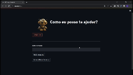

# Criação de um assistente virtual
Este repositório contém um script que permite a criação de um assistente virtual por meio de uma API.

 

# _Objetivo do projeto_

O objetivo deste projeto é criar um assistente virtual baseado no modelo GPT-3.5 da OpenAI, capaz de interagir com os usuários e fornecer respostas relevantes a perguntas e consultas.

 

# _1. Problema de Negócio_

O problema de negócio que este projeto visa resolver é a necessidade de fornecer suporte e assistência eficazes aos usuários de forma rápida e eficiente. Com um assistente virtual alimentado por GPT-3.5, podemos automatizar respostas a perguntas comuns e melhorar a experiência do usuário.

 

# _2. Justificativa_

- **Por quê:** A automação de respostas a perguntas frequentes pode economizar tempo e recursos, tanto para a equipe de suporte quanto para os usuários.
- **Como:** Utilizando o modelo GPT-3.5 da OpenAI, que é capaz de gerar respostas humanizadas e contextuais.
- **O quê:** Criar um assistente virtual que possa responder a uma variedade de perguntas e consultas dos usuários de forma eficaz e natural.

 

# _3. Premissas_

- O projeto pressupõe que os usuários terão acesso à interface web para interagir com o assistente virtual.
- É necessário configurar uma chave de API do GPT-3 no arquivo de ambiente .env para que o assistente funcione corretamente.
- Os dados da conversa entre o usuário e o assistente são armazenados temporariamente na sessão do usuário e podem ser limpos a qualquer momento.

 

# _4. Planejamento da Solução_

O projeto utiliza a biblioteca Streamlit para criar uma interface de usuário simples e amigável. A solução se baseia nas seguintes etapas:

1. Inicialização da sessão do usuário.
2. Configuração da chave de API do GPT-3.
3. Interação do usuário por meio da interface web.
4. Processamento das perguntas do usuário e geração de respostas pelo assistente virtual.
5. Exibição das perguntas e respostas na interface.

 

# _5. Conclusão_

Este projeto oferece uma solução eficaz para a automação do atendimento ao cliente e suporte por meio de um assistente virtual alimentado pelo modelo GPT-3.5 da OpenAI. Através dessa implementação, os usuários podem obter respostas rápidas e relevantes para suas perguntas, melhorando sua experiência de uso.

 

 

# _6. Próximos passos_

- Melhorar a interface de usuário para torná-la mais intuitiva e atraente.
- Implementar recursos avançados, como detecção de intenções do usuário.
- Treinar o modelo GPT-3.5 com dados específicos do domínio para respostas mais precisas.
- Integrar o assistente virtual em outros canais de comunicação, como aplicativos de mensagens e e-mail.
- Realizar testes extensivos e coletar feedback dos usuários para aprimorar o assistente virtual continuamente.
